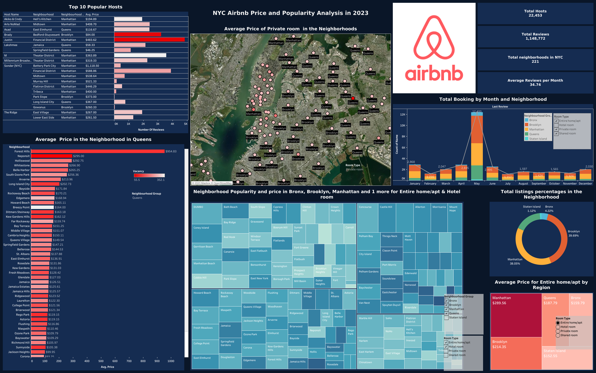

# Interactive Data Analysis Dashboard for Airbnb in NYC

An interactive dashboard for visualizing Airbnb's pricing and popularity trends across various neighborhoods in New York City. Built with Tableau.

## Features

- **Top Popular Hosts**: Highlights the hosts with the highest bookings/reviews.
- **Average Price Visualization**: Geographical map indicating average prices of specific room types by neighborhood.
- **Bookings Overview**: Time-series data showing bookings per month per neighborhood.
- **Price Insights**: Bar graphs representing average prices across neighborhoods.
- **Heatmaps**: Visualizing neighborhood popularity and room type price variations.
- **Listing Distribution**: Pie chart showing listing distribution by neighborhood.

## Prerequisites

- Tableau Desktop or Tableau Public
- Source Data from Airbnb (preferably in CSV or Excel format)

## Getting Started

- 1, Clone this repository:

- 2, Open the .twbx file in Tableau Desktop or Tableau Public.

- 3, If prompted, relink the data source to the appropriate Airbnb data file included in the repository.

- 4, Start interacting with the dashboard!

## 👩‍💻 Author
**Sheng Yun**
- Github: [@nickShengY<nickShengY>](https://github.com/nickShengY)
- Email: <syun13@fordham.edu>/<s24yun@uwaterloo.ca>

